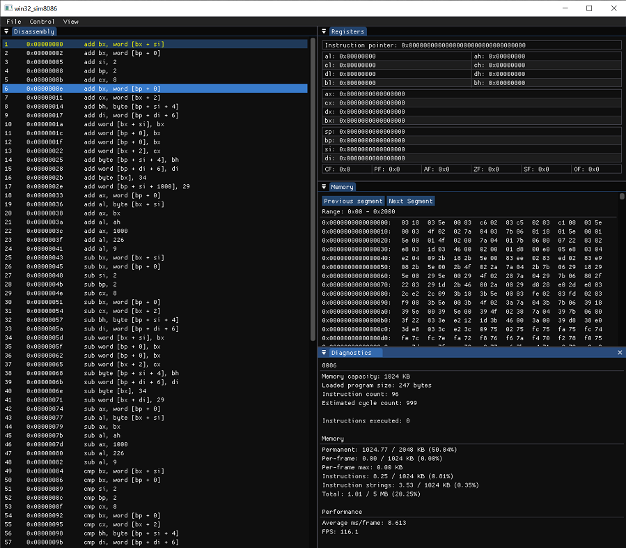

# perfaware
Homework solutions for Casey Muratori's [Performance-Aware Programming](https://www.computerenhance.com/p/table-of-contents) course.

## Included projects
Most projects (currently) require CL (MSVC) accessible via the PATH environment variable.

### cli_sim8086
The original homework assignment program from Part 1 of the course. A command line interface application that simulates an 8086 processor with a limited subset of x86 instructions supported. Built by executing [build-sim8086.bat](build-sim8086.bat) (using MSVC) or [build-sim8086.sh](build-sim8086.sh) (using clang).

### win32_sim8086
A Win32 version of the original 8086 simulator with a GUI. Inspired by Jeremy English's [Sim8088](https://codeberg.org/jeng/Sim8088) and [RemedyBG](https://remedybg.handmade.network/). This likewise is my attempt to gain some familiarity using IMGUI (and [DearImGui](https://github.com/ocornut/imgui) specifically). Currently only possesses a Windows layer but a Linux layer will be produced eventually.

This project is built by executing [build-win32-wi8086.bat](build-win32-wi8086.bat). On an interesting note, the program features Handmade Hero-style hot-loading of the application layer, which is extremely handy while building a GUI (Casey is a genius). Simply make your changes to the GUI script with the application running and re-execute the build script.

### haversine-gen
Part of the homework assignment for Part 2. Generates the Haversine distance pairs that will be used by the Haversine processor. Build by executing [build-haversine-gen.bat](build-haversine-gen.bat).

### haversine-proc
The second half of the homework assignment for Part 2. Consumes the Haversine distance pairs created by the generator. Build by executing [build-haversine-proc.bat](build-haversine-proc.bat).
